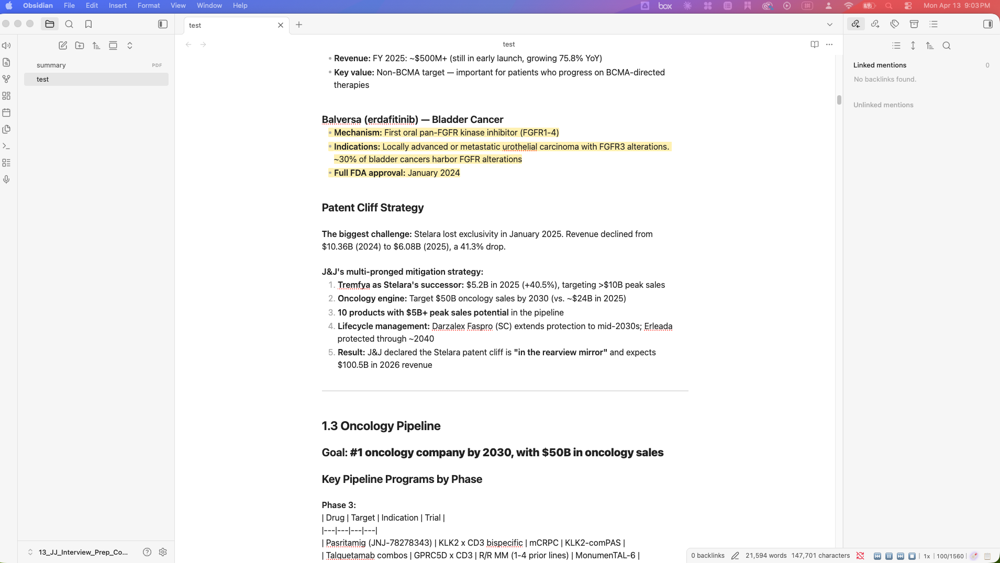
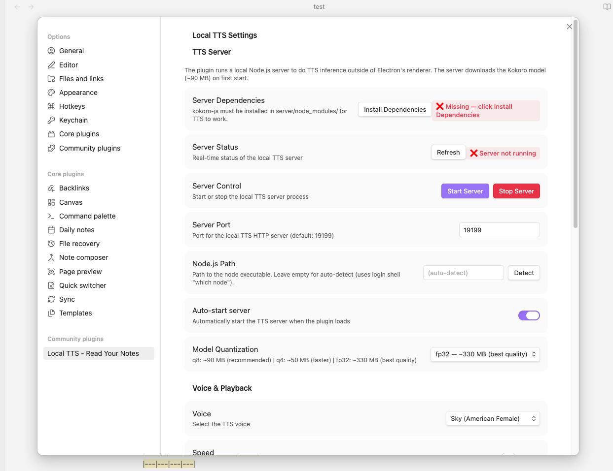
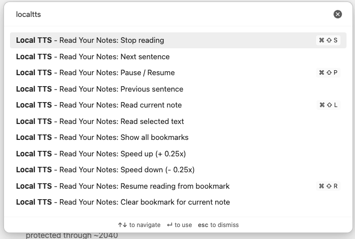
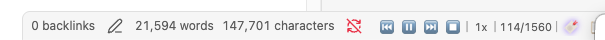
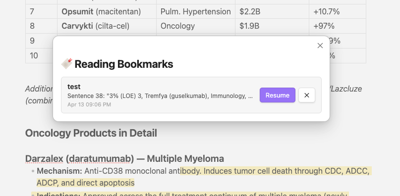

🌐 [English](README.md) | [中文](README_ZH.md) | [Deutsch](README_DE.md) | [日本語](README_JA.md) | [Español](README_ES.md) | [Français](README_FR.md) | [한국어](README_KO.md) | [Português](README_PT.md)

# Local TTS — Notizen laut vorlesen

Hochwertige **offline** neuronale Text-to-Speech-Funktion für Obsidian. Kein API-Schlüssel, kein Internet (nach dem ersten Start), kein Abonnement.

## Funktionen

- 🔇 **100 % offline** — läuft nach dem ersten Modell-Download vollständig lokal
- 🧠 **Neuronale Qualität** — basiert auf Kokoro-82M, einem hochmodernen TTS-Modell mit 82 Mio. Parametern
- 📝 **Intelligentes Markdown-Parsing** — überspringt automatisch Codeblöcke, Frontmatter, URLs, Tags, Matheblöcke, Kommentare
- ✨ **Satz-Hervorhebung** — der Editor hebt den aktuell gelesenen Satz hervor
- 📍 **Autoscroll** — der Editor scrollt automatisch zum aktuellen Satz
- 🔖 **Lesezeichen & Fortsetzen** — speichert die Position automatisch beim Pausieren oder Stoppen
- ⚡ **Streaming-Wiedergabe** — Audio beginnt sofort, während die nächsten Sätze vorberechnet werden
- 🎛️ **Wiedergabesteuerung** — Play/Pause, Satz überspringen, variable Geschwindigkeit (0,5×–2,0×)
- 🗣️ **7 Stimmen** — amerikanisches und britisches Englisch, männlich und weiblich
- 🖥️ **Nur Desktop** — macOS, Windows, Linux (erfordert Electron / Node.js)

## Screenshots

### Lesen mit Satz-Hervorhebung

### Einstellungen

### Befehle

### Wiedergabesteuerung

### Lesezeichen

## Voraussetzungen

- **Obsidian Desktop** (nicht für Mobilgeräte)
- **Node.js ≥ 18** auf dem System installiert
  - macOS / Linux: Installation über [nvm](https://github.com/nvm-sh/nvm) oder [Homebrew](https://brew.sh)
  - Windows: Download von [nodejs.org](https://nodejs.org)
- ca. 90 MB Speicherplatz für das Standardmodell
- Internetzugang **nur** beim ersten Modell-Download (danach vollständig offline)

## Installation

### Manuell (bis zur Genehmigung als Community-Plugin)

1. `main.js`, `styles.css`, `manifest.json` und den Ordner `server/` aus dem [neuesten Release](https://github.com/applefavorite/obsidian-local-tts/releases) herunterladen.
2. Alles nach `<vault>/.obsidian/plugins/obsidian-local-tts/` kopieren.
3. **Local TTS** unter Einstellungen → Community-Plugins aktivieren.

Das Plugin installiert seine Server-Abhängigkeiten (`kokoro-js`) beim ersten Laden automatisch.

### Checkliste für den ersten Start

1. Einstellungen → Local TTS öffnen.
2. **Server Dependencies** zeigt ✅. Falls nicht, auf **Install Dependencies** klicken.
3. Der TTS-Server startet automatisch (Server Status zeigt ✅ Running).
4. Beim ersten Start wird das Kokoro-Modell (~90 MB) von HuggingFace heruntergeladen — je nach Verbindung 1–3 Minuten.
5. Sobald der Status **model ready** anzeigt, eine Notiz öffnen und `Cmd/Ctrl + Shift + L` drücken.

## Verwendung

| Aktion | Wie |
|--------|-----|
| Aktuelle Notiz vorlesen | `Cmd/Ctrl + Shift + L` oder 🔊 in der Seitenleiste anklicken |
| Ausgewählten Text vorlesen | Text markieren → Rechtsklick → Read selection aloud |
| Pause / Fortsetzen | `Cmd/Ctrl + Shift + P` oder ⏸ in der Statusleiste |
| Stopp | `Cmd/Ctrl + Shift + S` oder ⏹ in der Statusleiste |
| Ab Lesezeichen fortsetzen | `Cmd/Ctrl + Shift + R` oder „🔖 Resume" in der Statusleiste |

## Tastenkürzel

| Befehl | Standard-Tastenkürzel |
|--------|----------------------|
| Aktuelle Notiz vorlesen | `Cmd/Ctrl + Shift + L` |
| Pause / Fortsetzen | `Cmd/Ctrl + Shift + P` |
| Lesen stoppen | `Cmd/Ctrl + Shift + S` |
| Ab Lesezeichen fortsetzen | `Cmd/Ctrl + Shift + R` |
| Nächster Satz | — (in Hotkeys zuweisbar) |
| Vorheriger Satz | — |
| Schneller (+0,25×) | — |
| Langsamer (−0,25×) | — |
| Alle Lesezeichen anzeigen | — |
| Lesezeichen der aktuellen Notiz löschen | — |

## Startposition wählen

Nach `Cmd/Ctrl + Shift + L` erscheint ein Auswahlfenster:

- **From beginning** — ab Satz 1 starten
- **From cursor** — ab dem Satz, in dem sich der Cursor befindet
- **From bookmark** *(falls vorhanden)* — ab der zuletzt gespeicherten Position

## Lesezeichen-System

- Ein Lesezeichen wird **automatisch gespeichert**, wenn Sie pausieren oder stoppen.
- Es speichert Satzindex und eine Vorschau des Textes.
- Die **🔖 Resume**-Kapsel in der Statusleiste erscheint, wenn die aktive Notiz ein Lesezeichen hat.
- Während der Wiedergabe auf 🔖 klicken, um zum Lesezeichen zu springen.
- Rechtsklick auf 🔖 löscht das Lesezeichen.
- 📋 zeigt alle Lesezeichen im Vault.

## Stimmen

| Stimme | Beschreibung |
|--------|-------------|
| af_sky *(Standard)* | Amerikanisch-englische Frauenstimme — Sky |
| af_bella | Amerikanisch-englische Frauenstimme — Bella |
| af_nicole | Amerikanisch-englische Frauenstimme — Nicole |
| am_adam | Amerikanisch-englische Männerstimme — Adam |
| am_michael | Amerikanisch-englische Männerstimme — Michael |
| bf_emma | Britisch-englische Frauenstimme — Emma |
| bm_george | Britisch-englische Männerstimme — George |

## Einstellungsübersicht

### TTS-Server
| Einstellung | Standard | Hinweise |
|-------------|----------|---------|
| Server Dependencies | — | Zeigt Installationsstatus; Schaltfläche zum Installieren |
| Server Status | — | Live-Abfrage; zeigt Modell-Ladefortschritt |
| Auto-start server | Ein | Startet Server beim Laden des Plugins |
| Server Port | 19199 | Ändern bei Portkonflikten |
| Node.js Path | Automatisch | Manuell setzen, falls Erkennung fehlschlägt |
| Model Quantization | q8 (~90 MB) | q4 = schneller/kleiner; fp32 = beste Qualität |

### Stimme & Wiedergabe
| Einstellung | Standard |
|-------------|----------|
| Voice | af_sky |
| Speed | 1,0× |
| Auto-scroll | Ein |
| Highlight current sentence | Ein |
| Highlight color | Gelb 30 % |

### Inhaltsfilter (standardmäßig alle aktiv)
Codeblöcke · Frontmatter · Kommentare · Fußnoten · URLs · Hashtags · Matheblöcke überspringen

## Bekannte Einschränkungen

- **Nur Desktop** — ONNX Runtime benötigt native Node.js-Binärdateien, die auf Obsidian Mobile nicht verfügbar sind.
- **Node.js erforderlich** — der Inferenz-Server läuft als separater Node.js-Prozess.
- **Erstmaliges Internet** — das Kokoro-Modell wird nur beim ersten Mal von HuggingFace heruntergeladen.
- **macOS Gatekeeper** — bei nvm-Installation wird Node.js über die Login-Shell erkannt; bei Fehler Pfad manuell eintragen.
- **Nur Quellansicht** — die Satz-Hervorhebung funktioniert nur im Markdown-Quell-Editor, nicht in der Leseansicht.

## Häufige Fragen

**Die Statusleiste zeigt nichts.**
Die Wiedergabeleiste erscheint nur beim Lesen. Die 🔖 Resume-Kapsel erscheint nur, wenn die aktive Notiz ein Lesezeichen hat.

**Server zeigt dauerhaft „nicht gestartet".**
Einstellungen → Local TTS → Start Server. Node.js Path prüfen und auf Detect klicken.

**Fehler „node nicht gefunden".**
Node.js (≥ 18) installieren, dann in den Einstellungen auf **Detect** klicken oder den Pfad manuell eingeben.

**Modell-Download langsam oder fehlerhaft.**
Das ~90-MB-Modell wird von HuggingFace geladen. Bei Timeout Server neu starten — der Download wird fortgesetzt.

**Audio klingt abgehackt.**
Parallele Vorberechnungen in Einstellungen → Erweitert reduzieren (Standard: 3) oder schnellere Quantisierung (q4) wählen.

**Hervorhebung bleibt beim ersten Satz hängen.**
Sicherstellen, dass der Quell-Editor aktiv ist (nicht die Leseansicht). Falls das Problem bestehen bleibt, Plugin deaktivieren und neu aktivieren.

---

> Gefällt Ihnen Offline-TTS? Schauen Sie sich **PaperVoice** im App Store an — KI-gestützter PDF-Reader für wissenschaftliche Artikel.

## Unterstützung

Wenn dieses Plugin nützlich ist, freue ich mich über einen Kaffee ☕

## Lizenz

MIT © 2025 applefavorite
